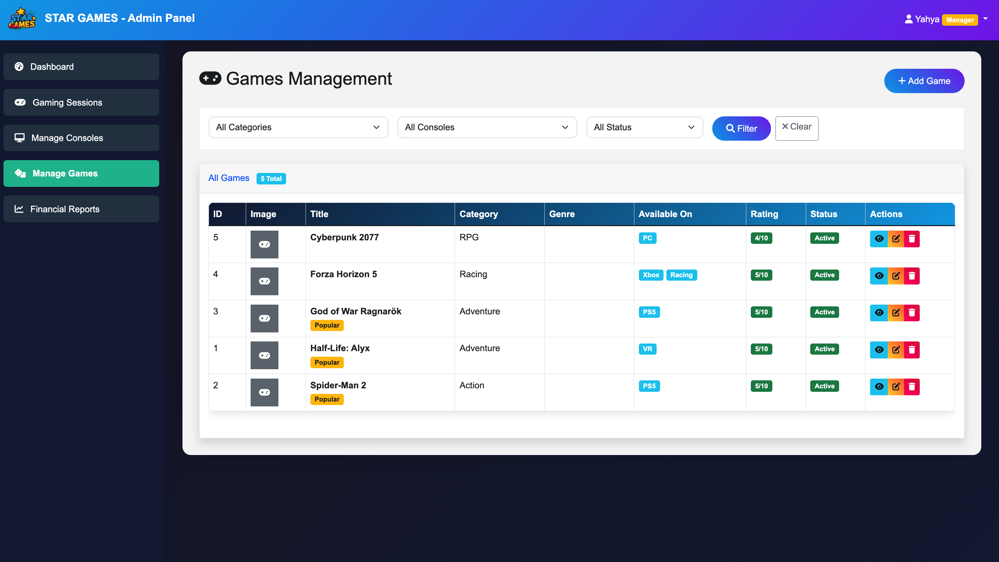

# 🎮 Star Games - Gaming Arcade Management System

A comprehensive full-stack Laravel web application designed for managing gaming arcade operations, including session tracking, console management, game library, and financial reporting with role-based access control.

## 🚀 Live Demo
[View Live Site](https://stargames.up.railway.app)

## 📸 Screenshots

### Public Website - Hero Section

*Bilingual gaming arcade website with immersive hero section showcasing the ultimate gaming experience*

*Full Arabic language support with RTL layout for local market*

### Featured Gaming Systems

*Default images used - this would be changed later - 5/10/2025*
*Premium VR and PlayStation 5 Pro setups with real-time pricing*

### Popular Games Library

*Curated collection of popular games with ratings and multi-platform support*

### Admin Dashboard (Manager View)

*Real-time revenue tracking, active session monitoring, and business analytics*

### Console Management (Manager View)

*Complete console inventory management with availability status and hourly rates*

### Game Library Management (Manager View)

*Comprehensive game library with filtering by category, console platform, and status*

### Session Management (Manager View)

*Detailed session tracking with payment status and filtering capabilities*

### Staff Dashboard

*Simplified staff interface focused on session operations without financial data*

## ✨ Core Features

### Public Website
- **Bilingual Interface**: Full English/Arabic language support with RTL layout
- **Gaming Systems Showcase**: Featured VR, PS5, Xbox, PC, and racing simulators
- **Game Library Browser**: Filterable catalog with ratings and platform compatibility
- **Location Finder**: Interactive map and contact information
- **Responsive Design**: Optimized for desktop, tablet, and mobile devices

### Staff Portal (Limited Access)
- **Session Creation**: Quick session startup with customer details and console selection
- **Real-time Tracking**: Live duration monitoring for active gaming sessions
- **Session Management**: End sessions and update customer information
- **Console Status**: View available consoles for new bookings
- **Today's Activity**: Dashboard showing today's sessions and active console usage
- **No Financial Access**: Staff cannot view revenue, pricing, or payment history

### Manager Portal (Full Admin Access)
- **Comprehensive Dashboard**: 
  - Today's revenue and monthly earnings
  - Active session count in real-time
  - Total console inventory status
  - Revenue trend charts (last 7 days)
  
- **Financial Reports**:
  - Revenue tracking by period (daily/weekly/monthly/yearly)
  - Revenue breakdown by console type
  - Payment status monitoring
  - Average session value analytics

- **Console Management**:
  - Add/edit/delete gaming consoles
  - Track hourly rates and availability status
  - Assign games to specific consoles
  - Monitor console utilization

- **Game Library Management**:
  - Add/edit/delete games with images
  - Categorize by genre and platform
  - Set rating and popularity status
  - Multi-platform game support

- **Session Management**:
  - Complete session history with filters
  - Payment status tracking
  - Duration and revenue per session
  - Customer contact information
  - Session notes and details

## 🛠️ Tech Stack

- **Backend**: Laravel 12, PHP 8.2
- **Database**: MySQL with Eloquent ORM
- **Frontend**: 
  - Bootstrap 5 for admin panels
  - Custom CSS with animations for public site
  - Vite for asset compilation
  - Blade templating engine
- **Authentication**: Laravel Breeze with role-based middleware
- **Hosting**: Railway.app with automatic deployments
- **Version Control**: Git with private repository

## 🔐 Access Control & Security

### Role-Based Authorization
- **Staff Role**:
  - Limited to session management interface
  - Cannot view financial data or reports
  - Cannot access console/game management
  - Full-width interface without admin sidebar
  
- **Manager Role**:
  - Complete system access
  - Financial reports and analytics
  - Console and game library management
  - Staff activity monitoring
  - Full admin dashboard with sidebar navigation

### Security Features
- Custom middleware for role verification
- CSRF protection on all forms
- Secure session management
- Password hashing with bcrypt
- SQL injection prevention via Eloquent ORM

## 📝 Key Implementation Highlights

### Database Architecture
- Normalized relational database design
- Gaming sessions linked to consoles, games, and users
- Many-to-many relationships for console-game compatibility
- Efficient indexing for real-time queries

### Real-Time Features
- Auto-refreshing active sessions (30-second intervals)
- Live duration calculation for ongoing sessions
- Dynamic console availability updates
- Instant payment status changes

### Bilingual System
- Language switcher with persistent preference
- RTL/LTR layout switching
- All content translated (English/Arabic)
- Arabic numerals and date formatting

### User Experience
- Smooth page transitions with loading screens
- Scroll animations on public website
- Responsive tables with pagination
- Modal dialogs for quick actions
- Color-coded status indicators

### Business Logic
- Automatic hourly rate calculation
- Session duration tracking in minutes
- Payment method recording
- Console status management (available/occupied)
- Revenue aggregation by period

## 🎯 Use Cases

1. **Customer Arrival**: Staff creates session, selects console, records payment
2. **Active Gaming**: System tracks duration in real-time, console marked as occupied
3. **Session End**: Staff ends session, system calculates final duration, frees console
4. **Daily Operations**: Manager views dashboard for today's revenue and active sessions
5. **Inventory Management**: Manager adds new games, updates console prices
6. **Financial Review**: Manager generates reports for weekly/monthly revenue analysis

## 📧 Contact

**Developer**: aa0123  
**Email**: alifarah0123@gmail.com  
**Project Type**: Gaming Arcade Management System  
**Status**: Production-ready, deployed on Railway.app

---

*This is a private repository. The showcase demonstrates the application's features, architecture, and implementation quality. Full source code available upon request for employment verification.*
